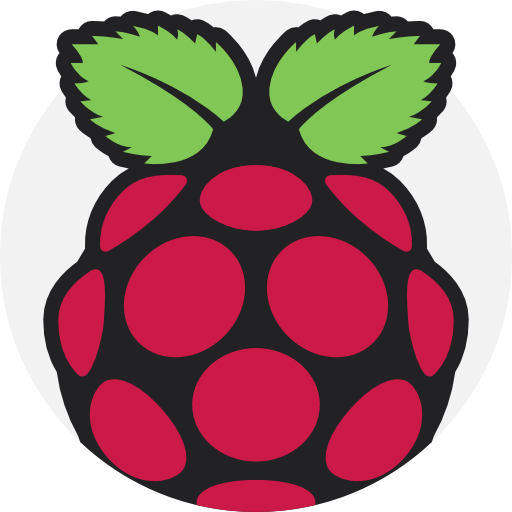

# Hi , I'm YuKai (Kerry) 

A Software/Firmware Engineer.  
Master's degree from the **Institute of Communications Engineering🛠️🛜** at NYCU.  
Focus on wireless LAN, cellular networks, and embedded systems.
<!--TODO: 一個小人在電腦前敲鍵盤的像素風動畫-->
## 🔭 About Me

* 🎓 **Education:** M.S. in Communications Engineering, National Yang Ming Chiao Tung University.
* 📡 **Research:** Ad-hoc in IEEE 802.11ah, Cross-layer Design, Power & Rate Control, and mobile communication.
* 💻 **Interests:**  Wireless LAN🛜, Cellular networks📱, Embedded system design📟.
* 🐾 **Personal:** A dedicated cat lover, including Uni-Lions. ⚾️🦁

## 🚀 Technical Skills

* **Languages:** C/C++, Python, MATLAB.
* **Systems & Platforms**: Linux Kernel, Raspberry Pi.
*   **Development Tools:** Git, Docker, ns-3 Network Simulator.
<!--image sources: Flaticon.com-->

  &nbsp;
  &nbsp;
  &nbsp;
  &nbsp;
  &nbsp;
  &nbsp;
  &nbsp;
  

